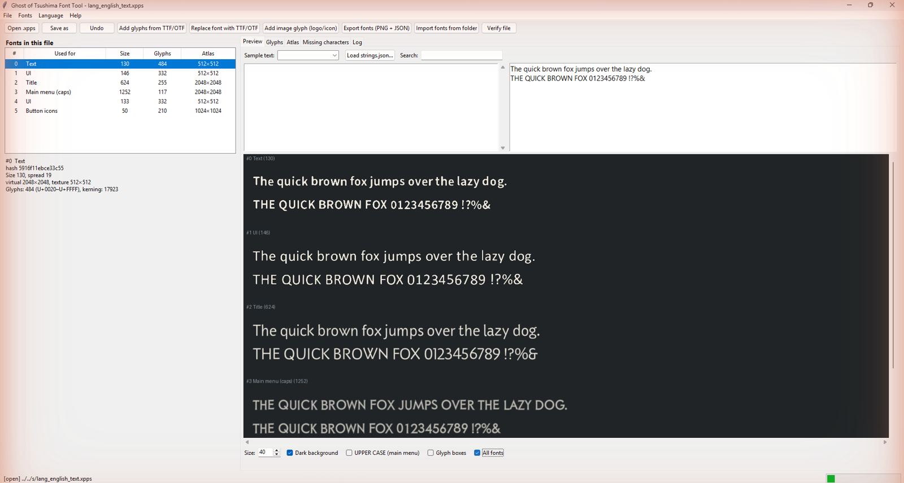
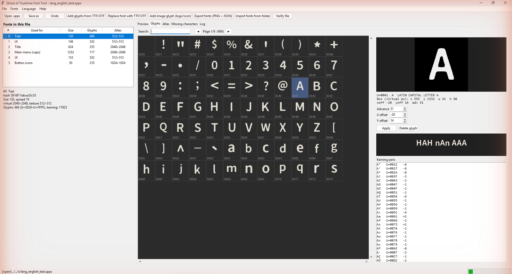

# Ghost of Tsushima Localization Tool (`xpps_tool`)


A dedicated game localization, translation, and modding utility for **Ghost of Tsushima Director's Cut**.
Extract game text from proprietary KCAP `.xpps` binary localization files into easily editable JSON, translate strings, inspect changes with built-in diffing, and repack them back into game-ready `.xpps` files.

The repository also contains **`got_font_tool`** — a font editor (GUI + CLI) for the in-game fonts: preview your
translation in the real game fonts, find missing letters, add glyphs from any TTF/OTF, replace whole fonts, fix
spacing and put logos/icons into the font. See **[Font Tool](#font-tool-got_font_tool)**.




> **v3.0 — repack engine rewritten.** The v2.x "dynamic relocation" mode produced broken files as soon as the
> text no longer fit the original pool: it read the KNLI reloc count as a pointer count (so padding and the
> ` DIC` footer were re-encoded as garbage relocations), it did not move the root object that owns the text
> descriptor (payload slot `0x68`), and it hard-coded a 208-byte KNLI footer (wrong for ar/ja/zh files).
> v3.0 keeps the original string pool untouched, appends new text after it, shifts everything behind it by one
> 4 KiB-aligned delta and rewrites every pointer from the decoded relocation list. Repacking without changes is
> bit-identical to the original, and every repack is verified structurally before it is written
> (`xpps_tool verify` can check any file). Multi-part subtitles can be edited per line with
> `extract --parts-as-list`. **Always use the untouched original `.xpps` as `-t` template.**
>
> **Timed subtitle lines.** Table-3 entries are split into lines, each with its own on-screen time window
> (the line's sub-hash encodes `end << 16 | start`). A space-joined text is mapped back onto those lines by
> word alignment with the original (edited/added words stay on their own line), so nothing slides into the
> next line's time slot. For a completely re-written line set, run
> `xpps_tool to-list strings.json -t original.xpps` and check/adjust the per-line lists by hand.
>
> **Layout strings are protected.** 55 Table-1 strings are empty or whitespace-only (`""`, `" "`, `"\n"`, …). The
> game inserts them between other texts (e.g. after a subtitle line), so writing text into them makes that text
> show up next to unrelated lines. `repack` keeps them unchanged and warns; `--allow-blank` overrides.

---

## Important Prerequisite: Extracting Game Files

In a standard Ghost of Tsushima PC installation, `.xpps` localization files are **not loose files** in the game folder. They are packed inside the game's `.psarc` archive files located in:
`<GameDirectory>/cache_pc/psarc/` (specifically archive files starting with `l`, such as language audio/text archives).

### How to get the `.xpps` files:
1. Download the companion **Ghost of Tsushima PSARC / DSAR Tool**:  
   👉 **[https://github.com/mstww/Ghost-of-Tsushima-PSARC-Tool](https://github.com/mstww/Ghost-of-Tsushima-PSARC-Tool)**
2. **Back up** `cache_pc/psarc/gapack_misc_l.psarc`, then unpack it:
   `got_psarc_tool.exe unpack gapack_misc_l.psarc` (or drag the archive onto `got_psarc_tool.exe`).
3. Once unpacked, you will have the raw `.xpps` files (e.g. `lang_english_text.xpps`, `lang_turkish_text.xpps`, etc.).
   Keep an untouched copy of the file you translate (e.g. `lang_turkish_text.xpps.bak`) — it is the repack template.
4. Use this tool (**`xpps_tool`**) to extract, edit, translate, and repack the `.xpps` text files.
5. Put the repacked `.xpps` into the unpacked folder and rebuild the archive with
   `got_psarc_tool.exe pack gapack_misc_l` (or drag the folder onto `got_psarc_tool.exe`).

---

## Table of Contents

- [Features](#features)
- [Installation](#installation)
  - [Option A: Standalone Executable (No Python Required)](#option-a-standalone-executable-no-python-required)
  - [Option B: Python Script](#option-b-python-script)
- [Complete Modding & Translation Workflow](#complete-modding--translation-workflow)
  - [Step 0: Unpack `.psarc` with got_psarc_tool](#step-0-unpack-psarc-with-got_psarc_tool)
  - [Step 1: Extract Strings to JSON with `xpps_tool`](#step-1-extract-strings-to-json-with-xpps_tool)
  - [Step 2: Translate & Edit](#step-2-translate--edit)
  - [Step 3: Track Translation Progress (`diff`)](#step-3-track-translation-progress-diff)
  - [Step 4: Repack into `.xpps`](#step-4-repack-into-xpps)
  - [Step 5: Pack Back into Game](#step-5-pack-back-into-game)
- [CLI Reference](#cli-reference)
  - [1. `extract`](#1-extract)
  - [2. `repack`](#2-repack)
  - [3. `diff`](#3-diff)
- [Font Tool (`got_font_tool`)](#font-tool-got_font_tool)
  - [What fonts does the game have?](#what-fonts-does-the-game-have)
  - [Installation & start](#installation--start)
  - [Recommended translation workflow with fonts](#recommended-translation-workflow-with-fonts)
  - [GUI guide](#gui-guide)
  - [CLI reference (`got_font_tool`)](#cli-reference-got_font_tool)
  - [Editing fonts by hand (PNG + JSON)](#editing-fonts-by-hand-png--json)
  - [Tips, limits and troubleshooting](#tips-limits-and-troubleshooting)
  - [Font format (for reverse engineers)](#font-format-for-reverse-engineers)
- [Supported Languages (27 Languages)](#supported-languages-27-languages)
- [KCAP & KNLI Relocation Architecture](#kcap--knli-relocation-architecture)
- [Türkçe Yerelleştirme ve Çeviri Rehberi](#türkçe-yerelleştirme-ve-çeviri-rehberi)
- [License](#license)

---

## Features

- **Extract Game Text**: Unpacks 32,000+ UI, menu, quest, subtitle, and dialogue strings from proprietary KCAP `.xpps` files into clean, readable JSON format.
- **Dual-Engine Binary Repacker**:
  - **Duplicate-Slot In-Pool Engine**: Reclaims unused duplicate slots (85KB+ slack space) for instant, surgical translation edits with 99.996% identical binary layout.
  - **Dynamic Relocation & KNLI Re-encoding Engine (v2.2)**: Solves the notorious relocation breakdown! Dynamically resizes the string pool, shifts internal descriptors and tables, recalculates Section 7/8 boundaries, and re-encodes the Sucker Punch Section 8 KNLI relocation bytecode from scratch. Supports arbitrary text length and **2x, 5x, 10x file size expansion** without crashing or memory corruption.
- **Built-in Verification**: Automatically re-extracts and verifies repacked files against templates to ensure 100% round-trip binary integrity.
- **Translation Progress & Diff Tool**: Compare translation files against the original game text, calculate translation percentages, and view changed lines.
- **Drag & Drop Support**: Drag a `.xpps` file onto `xpps_tool.exe` to instantly extract its text.
- **Standalone Release**: Includes a pre-compiled Windows `.exe` (`xpps_tool.exe`) — no Python or environment setup needed.
- **Pure Python**: Zero external dependencies when running from source (`os`, `struct`, `json`, `re`, `argparse`).
- **Clean PUA Glyphs Option**: Option to strip gamepad button icons (Square, Cross, Circle) for clean text editing.
- **Font Tool (`got_font_tool`, GUI + CLI)**: preview text in the game fonts, list missing characters of your translation, add glyphs from TTF/OTF (size, baseline, SDF and kerning matched automatically), replace fonts, edit glyph spacing, add logo/icon glyphs, export/import atlases as PNG + JSON.

---

## Installation

### Option A: Standalone Executable (No Python Required)
1. Download `xpps_tool.exe` from the repository root or [Releases](../../releases).
2. Place `xpps_tool.exe` in your working folder.
3. Open PowerShell or Command Prompt and run:
   ```cmd
   xpps_tool.exe --help
   ```

### Option B: Python Script
Requires Python 3.8 or higher.
```bash
git clone https://github.com/mstww/Ghost-Of-Tsushima-xpps-Localization-tool.git
cd Ghost-Of-Tsushima-xpps-Localization-tool

# Standard library only — no pip install needed!
python xpps_tool.py --help

# the font tool needs a few packages (tkinter ships with Python on Windows)
pip install -r requirements.txt
python got_font_tool.py            # opens the GUI
python got_font_tool.py --help     # command line
```

---

## Complete Modding & Translation Workflow

```
[Ghost of Tsushima Game Files]
       │
       ▼
 [cache_pc/psarc/gapack_misc_l.psarc]
       │
       │  (Unpack with got_psarc_tool unpack)
       ▼
 [lang_*_text.xpps]
       │
       │  (Extract with xpps_tool extract)
       ▼
 [translation.json]  ◄── (Translate in VS Code / Notepad++)
       │
       │  (Check with xpps_tool diff)
       ▼
 [lang_*_text.xpps]  (Repack with xpps_tool repack)
       │
       │  (optional: fonts with got_font_tool — missing letters, logos, other fonts)
       │
       │  (Repack with got_psarc_tool pack)
       ▼
[Ready to Play in Game!]
```

### Step 0: Unpack `.psarc` with got_psarc_tool
1. Download [Ghost of Tsushima PSARC / DSAR Tool](https://github.com/mstww/Ghost-of-Tsushima-PSARC-Tool).
2. Back up and unpack the language archive:
   ```bash
   copy gapack_misc_l.psarc gapack_misc_l.psarc.orig
   got_psarc_tool.exe unpack gapack_misc_l.psarc
   ```
3. You will obtain the `.xpps` files (e.g. `lang_english_text.xpps`, `lang_turkish_text.xpps`) plus a `Filenames.txt` used for repacking.

### Step 1: Extract Strings to JSON with `xpps_tool`
Extract text from your target language file (e.g. English as a base, or Turkish):
```bash
# Extract to a single JSON file
xpps_tool.exe extract lang_english_text.xpps -o english_strings.json

# Or extract all 27 languages at once into organized folders
xpps_tool.exe extract <folder_with_xpps_files> -o translations/
```

### Step 2: Translate & Edit
Open `english_strings.json` in any text editor (VS Code, Notepad++, Sublime Text, etc.):
```json
{
  "00000002db95e0f0": "Cut",
  "00000002db9628be": "Eat",
  "00000002db962dcf": "End",
  "00000002db97e48c": "Point of Interest"
}
```
Edit the text values on the right. **Keep the 16-character hex keys unchanged**, as the game engine uses them to locate strings:
```json
{
  "00000002db95e0f0": "Kes",
  "00000002db9628be": "Ye",
  "00000002db962dcf": "Bitir",
  "00000002db97e48c": "Önemli Konum"
}
```

### Step 3: Track Translation Progress (`diff`)
Check how many strings have been translated and view sample changes:
```bash
xpps_tool.exe diff lang_english_text.xpps my_turkish_translation.json
```
Example output:
```
==================================================
Translation Progress & Statistics
==================================================
  Total original strings:     32,459
  Total translated strings:   32,459
  Modified / Translated:       4,250  (13.09%)
  Identical (untouched):      28,209

Sample Modified Strings (first 5):
  [00000002db95e0f0]
    - Original:   Cut
    + Translated: Kes
```

### Step 4: Repack into `.xpps`
Rebuild the game-ready `.xpps` file using the original file as a binary template:
```bash
xpps_tool.exe repack my_turkish_translation.json -t lang_turkish_text.xpps.bak -o gapack_misc_l\lang_turkish_text.xpps
```
Always use the **untouched original** file of the same language as template (`-t`). The output is verified
structurally against it before it is written.

### Step 5: Pack Back into Game
Rebuild the archive with [got_psarc_tool](https://github.com/mstww/Ghost-of-Tsushima-PSARC-Tool) and copy it back to `cache_pc/psarc/`:
```bash
got_psarc_tool.exe pack gapack_misc_l gapack_misc_l.psarc
```
Only files listed in `Filenames.txt` are packed, with the same layout as the original game archive.

---

## CLI Reference

### 1. `extract`
Extracts strings from a single `.xpps` file or a directory of `.xpps` files.

```bash
xpps_tool.exe extract <input> [-o OUTPUT] [--clean-pua]
```
- `<input>`: Path to a single `.xpps` file (e.g. `lang_turkish_text.xpps`) or a folder.
- `-o, --output`:
  - If given a path ending in `.json` (e.g. `-o tr.json`), writes directly to that file.
  - If given a directory path, extracts into `<output>/<lang>/strings.json`.
- `--clean-pua`: Removes gamepad button glyphs (Unicode Private Use Area icons `\ue000`–`\uf8ff`) for clean text reading.

### 2. `repack`
Rebuilds a game `.xpps` file from an edited translation JSON.

```bash
xpps_tool.exe repack <strings_file> -t <template> [-o OUTPUT] [--force-expand] [--no-verify]
```
- `<strings_file>`: Path to your translated `strings.json` file.
- `-t, --template`: Path to the original game `.xpps` file used as the layout template.
- `-o, --output`: Destination path (default: `<template>_modded.xpps`).
- `--force-expand`: Forces the Dynamic Relocation & KNLI Re-encoding Engine even if modifications fit into duplicate string slots.
- `--no-verify`: Skips automatic extraction verification after repacking.

> [!TIP]
> **Automatic Mode Selection**:
> If your changes are small (e.g. tweaking a few hundred strings or menus), `xpps_tool` automatically uses the **Duplicate-Slot In-Pool Engine**, keeping 99.996% of the original binary identical.
> If your changes exceed available slot space or you translate large chunks of text, `xpps_tool` **automatically switches to the Dynamic Relocation & KNLI Engine**, rebuilding all pointers and relocation tables with zero limits on length or file size!

### 3. `diff`
Compares two translation files or checks mod progress.

```bash
xpps_tool.exe diff <file1> <file2> [-o OUTPUT]
```
- `<file1>`: Base file (original `.xpps` or `strings.json`).
- `<file2>`: Translated file (edited `.xpps` or `strings.json`).
- `-o, --output`: Optional path to export all modified translation lines into a separate JSON file.

---

## Font Tool (`got_font_tool`)

`got_font_tool` edits the fonts that the game uses to draw text. It has a **graphical interface** (default —
just double-click `got_font_tool.exe`) and a full **command line** (`got_font_tool.exe --help`) for scripts.



What a translator can do with it:

| Task | GUI | CLI |
|------|-----|-----|
| See any text (or any line of your `strings.json`) in the real game fonts | **Preview** tab | `preview` |
| Find letters your translation needs but a font does not have | **Missing characters** tab | `list --from-json` |
| Add those letters from any TTF/OTF font (auto size/baseline, SDF, kerning) | **Add glyphs from TTF/OTF** | `add` |
| Replace a whole font (e.g. a title font that suits your language better) | **Replace font with TTF/OTF** | `replace` |
| Fix the spacing of a glyph (advance / x / y offset) or delete it | **Glyphs** tab | `export` → edit JSON → `import` |
| Put a logo / icon / symbol into the font and use it in text | **Add image glyph** | `addimg` |
| Edit atlases by hand in Photoshop/GIMP | **Export fonts** / **Import fonts from folder** | `export` / `import` |
| Check a file before putting it into the game | **Verify file** | `verify` |

### What fonts does the game have?

The fonts are **inside every language pack** `lang_<language>_text.xpps` (archive `gapack_misc_l.psarc`), so each
language has its own copy and you only change the language you translate. A typical pack contains:

| Used for (as shown by the tool) | Size | Glyphs | Notes |
|---|---|---|---|
| **Text** | 130 | ~484 | subtitles, dialogue, descriptions (Latin, Greek, Cyrillic, Turkish…) |
| **UI** (two fonts) | 146 / 133 | ~332 | menus, HUD, labels |
| **Title** | 624 | ~255 | big titles (language specific) |
| **Main menu (caps)** | ~1050–1250 | ~117–180 | main-menu entries; the game shows them in UPPER CASE |
| **Button icons** | 50 | 210 | gamepad/keyboard icons in the Private Use Area — block compressed, **not editable** |

Japanese, Chinese and Korean packs also contain big CJK fonts (1300–3200 glyphs), Thai has an extra title font.
All fonts are **signed distance fields** (SDF): each glyph is stored as a distance map, so it stays sharp at any
size, and the tool creates new glyphs in exactly the same way (same spread and slope as the original ones).

### Installation & start

* **Windows exe:** download `got_font_tool.exe` from [Releases](../../releases) and double-click it — the GUI opens.
  Drag a `.xpps` onto the exe to open it directly. For the command line run it from a terminal with arguments.
* **Python:** `pip install -r requirements.txt` (numpy, Pillow, scipy, fontTools), then `python got_font_tool.py`.
* The interface is in English; **Language → Türkçe** switches it to Turkish.

### Recommended translation workflow with fonts

`xpps_tool repack` always starts from its template file. Do the font work **once on the original file** and
use the result as the template for every later text repack — then you never have to redo the fonts:

```bash
# 1. unpack the archive (keep a backup of the original!)
got_psarc_tool.exe unpack gapack_misc_l.psarc
copy gapack_misc_l\lang_turkish_text.xpps lang_turkish_text.xpps.bak

# 2. translate as usual
xpps_tool.exe extract lang_turkish_text.xpps.bak -o tr.json
#    ... edit tr.json ...

# 3. which letters are missing? (GUI: "Missing characters" tab)
got_font_tool.exe list lang_turkish_text.xpps.bak --from-json tr.json

# 4. add them to all fonts from a TTF/OTF and save as the new template
got_font_tool.exe add lang_turkish_text.xpps.bak --ttf MyFont.ttf --from-json tr.json --kern -o lang_turkish_text.fonts.xpps

# 5. repack the text using the font-edited file as template (repeat this step whenever tr.json changes)
xpps_tool.exe repack tr.json -t lang_turkish_text.fonts.xpps -o gapack_misc_l\lang_turkish_text.xpps

# 6. rebuild the archive and copy it to cache_pc/psarc/
got_psarc_tool.exe pack gapack_misc_l gapack_misc_l.psarc
```

If the translation later needs more new letters, run step 4 again on `lang_turkish_text.fonts.xpps` (the tool
can edit its own output as often as you like) and repack. The font tool can also be run on an already repacked
file — both tools keep each other's data and relocation tables intact.

### GUI guide

**Toolbar / menus** — *Open .xpps*, *Save as*, *Undo* (last 4 operations), *Revert* (File menu: reload from
disk), *Add glyphs from TTF/OTF*, *Replace font with TTF/OTF*, *Add image glyph*, *Export fonts*, *Import fonts
from folder*, *Verify file*. All edits stay in memory until you **Save as**; saving writes the file, verifies it
and reloads it. The title bar shows `*` while there are unsaved changes.

**Font list (left)** — every font of the file with its role, size, glyph count and atlas size. Select a font to
work with it; the box below shows details (virtual/texture size, spread, number of kerning pairs).

**Preview tab**
* Type any text, or choose a *Sample text* (pangrams for Turkish, English, German, French, Spanish, Portuguese,
  Italian, Polish, Czech, Hungarian, Romanian, Russian, Ukrainian, Greek, Vietnamese, Nordic).
* **Load strings.json…** loads your `xpps_tool` translation; use *Search* to find a line (by text or hash) and
  click it to see exactly how the game will draw it.
* Options: size, *Dark background* (game-like), *UPPER CASE* (how the main menu shows text), *Glyph boxes*
  (shows each glyph's quad — useful for spacing problems), *All fonts* (renders the text with every font at once).
* Characters that the selected font does not have are listed in red under the options — in the game they would
  be drawn as an empty box.

**Glyphs tab**
* A grid of all glyphs (search by characters, e.g. `ğüşİ`, or code points, e.g. `U+2605`).
* Click a glyph to see it large, its Unicode name, atlas box, offsets, a context sample (`HxH nxn xxx`) and all of
  its kerning pairs.
* Change **Advance** (width), **X offset**, **Y offset** and press **Apply** to fix spacing; **Delete glyph**
  removes it (and kerning pairs that point to it).

**Atlas tab** — the SDF texture of the font (fit / 25 / 50 / 100 %), optional glyph boxes. Click a glyph in the
atlas to jump to it in the Glyphs tab.

**Missing characters tab** — paste text or load a `strings.json` / `.txt`, press **Check**: each font gets a
row with the number and list of missing characters (the main-menu font is checked against the upper-cased
text). **Add missing characters from TTF…** opens the add dialog pre-filled with exactly those characters and fonts.

**Add glyphs dialog** — choose a TTF/OTF (the file dialog opens in `C:\Windows\Fonts`), the characters and the
target fonts. Options: *Import kerning from the font*, *Re-render characters that already exist* (to change the
look of existing letters), *Size multiplier* (1.0 = matched automatically to the game font's cap height),
*Baseline shift* (virtual px, + moves down), and what to do when the atlas is full (grow one side = smaller file,
the same 2:1 shape the game uses for its CJK fonts; or grow both sides).

**Replace font dialog** — rebuilds every glyph of the selected fonts from the TTF/OTF (the charset is kept;
characters the TTF lacks keep their original glyph; kerning is taken from the TTF). *Extra characters* are added
on top.

**Add image glyph dialog** — a PNG (transparent background, or white shape on black; tick *Black shape on white
background* for the opposite) is turned into an SDF glyph at the chosen character, e.g. `★` / `U+2605`. Height,
part below the baseline and side spacing are relative to the font's cap height. Use a character that no font
uses and that is **not** in the Private Use Area (U+E000–U+F8FF is taken by the button icons). Then write that
character into your translation, e.g. `"Destan Moduna Gir ★"`.

**Log tab** — output of every operation, including verification results.

### CLI reference (`got_font_tool`)

Running without arguments (or with only a file) opens the GUI. All editing commands write to `-o OUTPUT`
(default `<name>_font.xpps`) and verify the result.

| Command | Description |
|---------|-------------|
| `gui [file.xpps]` | open the GUI |
| `list <xpps> [--chars S] [--charfile F] [--from-json J]` | fonts in the file and the characters each one is missing |
| `export <xpps> [dir] [--font LIST]` | write `fontN_<hash>.png` (atlas) + `fontN_<hash>.json` (metrics, kerning) |
| `import <xpps> <dir> [-o OUT]` | read the PNG/JSON back (glyphs may be added/removed, PNG may be enlarged) |
| `add <xpps> --ttf F (--chars/--charfile/--from-json) [--font LIST] [--kern] [--replace-existing]` | render glyphs from a TTF/OTF |
| `replace <xpps> --ttf F [--font LIST] [--chars ...] [--no-kern]` | rebuild whole fonts from a TTF/OTF |
| `addimg <xpps> --image PNG --cp U+2605 [--font LIST] [--height 1.2] [--drop 0.1] [--bearing 0.08] [--invert]` | glyph from an image |
| `remove <xpps> --chars S [--font LIST]` | delete glyphs |
| `preview <xpps> --text "..." [--font LIST] [--height 96] [--upper] [-o PNG]` | render text to a PNG |
| `verify <xpps>` | check relocations, glyph tables and textures |

Common options of `add` / `replace`: `--scale 1.05` (bigger/smaller than the automatic match),
`--baseline-shift 4`, `--grow rect|square`, `--preview "text"` (also writes a preview PNG).
`--font` takes indexes or hash prefixes from `list`, e.g. `--font 0,1,4`; the default is all editable fonts.

```bash
got_font_tool.exe list    lang_polish_text.xpps --chars "ĄąĆćĘꣳŃńÓ󌜏źŻż"
got_font_tool.exe add     lang_english_text.xpps --ttf C:\Windows\Fonts\segoeui.ttf --from-json vi.json --kern -o vi.xpps
got_font_tool.exe replace lang_turkish_text.xpps --font 3 --ttf MyTitle.otf --preview "HAYALET" -o tr.xpps
got_font_tool.exe addimg  tr.xpps --image logo.png --cp U+2605 --preview "Test ★" -o tr_logo.xpps
got_font_tool.exe preview tr_logo.xpps --font 2 --upper --text "Destan Moduna Gir ★"
```

### Editing fonts by hand (PNG + JSON)

`export` writes, per font, an upright atlas `fontN_<hash>.png` and `fontN_<hash>.json`:

```json
{ "size": 130, "spread": 19, "virtual_width": 2048, "virtual_height": 2048,
  "texture_width": 512, "texture_height": 512,
  "glyphs": [ { "cp": 65, "char": "A", "x": 555, "y": 1332, "w": 91, "h": 98,
                "xoff": -20, "yoff": 14, "adv": 51, "kern": [[86, -3]] } ] }
```

* Coordinates are **virtual pixels** (`texture px × virtual / texture`), top-left origin. The box contains
  `spread` px of SDF padding on every side.
* `xoff` / `yoff` place the box relative to the pen position / top of the line, `adv` is the advance width.
* `kern` is a list of `[second_codepoint, amount]` (a code point may appear twice — keep the order).
* The PNG is an SDF: 128 = the outline, brighter = inside. Paint with soft gradients, not hard black/white.
* The PNG may change size (powers of two). If you **upscale** the whole atlas keep `virtual_*`; if you **extend
  the canvas** (more room at the right/bottom) multiply `virtual_width/height` by the same factor.
* `import` accepts added and removed glyphs; the file grows automatically when needed.

### Tips, limits and troubleshooting

* **An empty box in the game** means the font used there does not have that character. The main menu uses the
  *Main menu (caps)* font, subtitles the *Text* font, menus the *UI* fonts — when unsure add to all fonts.
* Only characters in the Basic Multilingual Plane (U+0000–U+FFFF) are supported by the game's glyph tables.
* The *Button icons* font is block compressed and cannot be edited (it is exported as a raw `.bin`).
* Growing an atlas makes the file bigger (e.g. 512×512 → 512×1024 ≈ +0.35 MB, 2048×2048 → 2048×4096 ≈ +5.6 MB).
* Right-to-left scripts and complex shaping (Arabic joining, Indic/Thai reordering) are not done by the
  game's renderer — the glyphs are drawn one after another as stored.
* Always keep the untouched original `.xpps`/`.psarc`. `verify` checks every relocation and glyph table.
* Replacing a font changes its look everywhere in that language; check long texts in the Preview tab with
  *Glyph boxes* on to see if the new font is wider than the old one.

### Font format (for reverse engineers)

```
font header (0x40): u64 hash | u32 id | f32 1/size | u16 size | u16 spread | f32 1/Vw | f32 1/Vh | f32 (1.0 or scale)
                    | u64 | u64 ->glyphs | u32 count | u32 0 | u64 ->texture desc+0x10
glyph (24):  u16 cp, x, y, w, h | s16 xoff, yoff | u16 adv | u64 ->kern record {u64 ->pairs, u32 n, u32 0}
pair (4):    u16 cp2 | s16 amount
texture desc (0x60): +0x28 u16 w,h | +0x2f u8 mips | +0x30 u32 size | +0x34 u32 format (0x00492001 = R8)
                     | +0x38 u64 ->pixels (second KNLI list)
texture: R8 SDF, 128 = edge, value = 128 + d * 142 / spread (d in virtual px), full mip chain, rows bottom-up
```
New glyph tables are appended to the end of the text section, the texture section is rebuilt when an atlas
grows, and the KNLI relocation stream, section table, memory-segment records and ` DIC` footer are updated.

---

## Supported Languages (27 Languages)

| Code     | Language              | Default File Name            |
|----------|-----------------------|------------------------------|
| `ar`     | Arabic                | `lang_arabic_text.xpps`      |
| `pt-br`  | Portuguese (Brazil)   | `lang_brazilian_text.xpps`   |
| `en-gb`  | English (UK)          | `lang_british_text.xpps`     |
| `zh-cn`  | Chinese (Simplified)  | `lang_chinese_s_text.xpps`   |
| `zh-tw`  | Chinese (Traditional) | `lang_chinese_text.xpps`     |
| `hr`     | Croatian              | `lang_croatian_text.xpps`    |
| `cs`     | Czech                 | `lang_czech_text.xpps`       |
| `da`     | Danish                | `lang_danish_text.xpps`      |
| `nl`     | Dutch                 | `lang_dutch_text.xpps`       |
| `en`     | English (US)          | `lang_english_text.xpps`     |
| `fi`     | Finnish               | `lang_finnish_text.xpps`     |
| `fr`     | French                | `lang_french_text.xpps`      |
| `de`     | German                | `lang_german_text.xpps`      |
| `el`     | Greek                 | `lang_greek_text.xpps`       |
| `hu`     | Hungarian             | `lang_hungarian_text.xpps`   |
| `it`     | Italian               | `lang_italian_text.xpps`     |
| `ja`     | Japanese              | `lang_japanese_text.xpps`    |
| `ko`     | Korean                | `lang_korean_text.xpps`      |
| `es-mx`  | Spanish (Latin America)| `lang_latino_text.xpps`     |
| `no`     | Norwegian             | `lang_norwegian_text.xpps`   |
| `pl`     | Polish                | `lang_polish_text.xpps`      |
| `pt`     | Portuguese (Portugal) | `lang_portuguese_text.xpps`  |
| `ru`     | Russian               | `lang_russian_text.xpps`     |
| `es`     | Spanish (Spain)       | `lang_spanish_text.xpps`     |
| `sv`     | Swedish               | `lang_swedish_text.xpps`     |
| `th`     | Thai                  | `lang_thai_text.xpps`        |
| `tr`     | Turkish               | `lang_turkish_text.xpps`     |

---

## KCAP & KNLI Relocation Architecture

Ghost of Tsushima uses Sucker Punch Productions' proprietary **KCAP** archive format with **KNLI** (Kernel Linker Information) relocation bytecode for memory rebasing:

```
[KCAP Container Header] (0x00 - 0x1E4)
  0x00: Magic ASCII "KCAP"
  0x28: Header Size (0x1E4 = 484 bytes)
  0x2C: Total Payload Size (uint32)
  0xC0: Secondary Section Table (Offsets & Sizes for Sec 7 & 8)
  0x168: Primary Section Table (12 bytes per section descriptor: flags, size, offset)

[KCAP Payload Layout]
  Sections 0 - 5: System and Sub-archive Descriptors
  Section 6: Text & Localization Section (Strings, Descriptors, Tables 1, 2, 3)
  Section 7: Language Font & Glyph Raster Data (13,631,568 bytes)
  Section 8: KNLI 64-bit Pointer Relocation Bytecode Table (127+ KB)

[Section 6 Layout]
  0x000000 .. desc_pos: Contiguous UTF-8 String Pool
  desc_pos: Master Localization Descriptor [T1_ptr, T1_cnt, T2_ptr, T2_cnt, T3_ptr, T3_cnt]
  Table 1: UI & Menu Strings (16 bytes: uint64 hash, uint64 str_ptr)
  Table 2: Engine Audio/Event Mappings (24 bytes: uint64 hash, uint64 sub_ptr, uint64 count)
  Table 3: Dialogue & Subtitle Cues (24 bytes: uint64 hash, uint64 sub_ptr, uint64 count)
    Table 3 Sub-entries: Array of (16 bytes: uint64 sub_hash, uint64 str_ptr)
  Tail: Format Descriptors & Engine Type Registrations
```

### Why Naive Repacking Broke Games (see the v3.0 note at the top for what changed)
1. **Engine Bounds Invariant**: The engine validates that every string pointer falls strictly inside `0 .. desc_pos`. In v2.2, all strings are positioned within this boundary and `desc_pos` dynamically expands.
2. **KNLI Relocation Bytecode**: When loaded into RAM, the engine traverses the KNLI stream and rebases every 64-bit pointer (`*(uint64_t*)(base + offset) += base`). If string expansion moves tables without updating KNLI, the engine rebases random memory, resulting in instant crashes.
3. **15-Bit Window Relocation Encoding**: `xpps_tool` v2.2 includes the world's first complete encoder/decoder for KNLI bytecode, recalculating all 63,400+ relocation pointers so that file size can grow to **2x, 5x, or 10x** seamlessly without crashing.

---

## Türkçe Yerelleştirme ve Çeviri Rehberi

Ghost of Tsushima Director's Cut için kendi yamanızı yapmak veya mevcut çevirileri düzenlemek için tam adımlar:

### 1. Ön Hazırlık (.psarc Dosyalarını Açma)
`.xpps` dil dosyaları oyunun `cache_pc/psarc/` klasöründeki `l` harfiyle başlayan `.psarc` arşivlerinin içindedir.
1. **Ghost of Tsushima PSARC / DSAR Tool** aracını indirin:  
   👉 **[https://github.com/mstww/Ghost-of-Tsushima-PSARC-Tool](https://github.com/mstww/Ghost-of-Tsushima-PSARC-Tool)**
2. `cache_pc/psarc/gapack_misc_l.psarc` dosyasının yedeğini alın ve açın:
   `got_psarc_tool.exe unpack gapack_misc_l.psarc` (veya arşivi `got_psarc_tool.exe` üzerine sürükleyin).
3. Böylece `lang_turkish_text.xpps` dosyasını elde edeceksiniz. Bu dosyanın dokunulmamış bir kopyasını
   (`lang_turkish_text.xpps.bak`) saklayın; repack için şablon olarak o kullanılacak.

### 2. Metinleri JSON Olarak Dışa Aktarma
```powershell
.\xpps_tool.exe extract lang_turkish_text.xpps -o turkce_ceviri.json
```
Bu komut 32.461 satırlık oyun metnini düzenlenebilir `turkce_ceviri.json` dosyasına çıkarır.

### 3. Çeviriyi Düzenleme (Sınırsız Karakter ve Uzunluk!)
JSON dosyasını VS Code veya Notepad++ ile açın. Sol taraftaki 16 haneli hex kodlarına dokunmadan sağ taraftaki metinleri dilediğiniz gibi uzatın ve düzenleyin:
```json
"8bc3029abeb1b9a2": "Başlamak için  düğmesine bas"
```
> [!NOTE]
> `xpps_tool` v3.0 ile **metin uzunluğu sınırı yoktur**. Orijinal metin havuzu korunur, yeni metin sonuna eklenir ve tüm pointer'lar relokasyon tablosundan yeniden yazılır. Çok satırlı altyazılar orijinal satır sınırlarına göre bölünür; satırları elle ayarlamak için `to-list` komutunu kullanın. Orijinalde boş olan metinler (`""`, `"\n"` …) korunur.

### 4. Çeviri İlerlemesini Kontrol Etme
```powershell
.\xpps_tool.exe diff lang_turkish_text.xpps turkce_ceviri.json
```
Bu komut kaç satırın çevrildiğini, yüzde kaç tamamlandığını ve örnek çevirileri gösterir.

### 5. Oyuna Uygun Hale Getirme (Repack)
```powershell
.\xpps_tool.exe repack turkce_ceviri.json -t lang_turkish_text.xpps.bak -o gapack_misc_l\lang_turkish_text.xpps
```

### 6. Oyuna Yükleme
Açılmış klasörü [got_psarc_tool](https://github.com/mstww/Ghost-of-Tsushima-PSARC-Tool) ile tekrar paketleyin ve `cache_pc/psarc/` içine kopyalayın:
```powershell
.\got_psarc_tool.exe pack gapack_misc_l gapack_misc_l.psarc
```

### 7. Fontlar: Eksik Harfler, Font Değiştirme, Logo (`got_font_tool`)

Oyun fontları her dil dosyasının (`lang_<dil>_text.xpps`) içindedir. `got_font_tool.exe` dosyasına çift
tıklayınca grafik arayüz açılır (**Language → Türkçe** ile arayüz Türkçe olur). `.xpps` dosyasını exe'nin üzerine
bırakarak da açabilirsiniz.

**Önerilen akış** — fontları bir kez orijinal dosya üzerinde düzenleyin, sonra metin repack'lerinde şablon olarak
bu dosyayı kullanın:
```powershell
# eksik harfleri göster
.\got_font_tool.exe list lang_turkish_text.xpps.bak --from-json turkce_ceviri.json
# eksik harfleri bir TTF/OTF'den tüm fontlara ekle (boyut, taban çizgisi ve kerning otomatik)
.\got_font_tool.exe add lang_turkish_text.xpps.bak --ttf Font.ttf --from-json turkce_ceviri.json --kern -o lang_turkish_text.fonts.xpps
# metni bu dosyayı şablon alarak paketle (çeviri her değiştiğinde yalnızca bu adım)
.\xpps_tool.exe repack turkce_ceviri.json -t lang_turkish_text.fonts.xpps -o gapack_misc_l\lang_turkish_text.xpps
```

**Arayüzde neler var?**
* **Önizleme:** yazdığınız metni ya da `strings.json` içinden seçtiğiniz satırı oyunun fontuyla gösterir.
  *Koyu arka plan*, *BÜYÜK HARF (ana menü)*, *Glif kutuları* ve *Tüm fontlar* seçenekleri vardır. Fontta olmayan
  karakterler kırmızıyla listelenir (oyunda boş kutu olarak görünürler).
* **Glifler:** tüm glifler ızgara hâlinde; arama (`ğüşİ` ya da `U+2605`), tıklayınca büyük görünüm, Unicode adı,
  kerning çiftleri. *İlerleme / X kayması / Y kayması* değiştirilip **Uygula** ile aralık düzeltilir, **Glifi sil**.
* **Atlas:** fontun SDF dokusu; bir glife tıklayınca Glifler sekmesinde açılır.
* **Eksik karakterler:** çevirinizi yapıştırın veya `strings.json` yükleyin, **Kontrol et** — her font için eksik
  harfler. **Eksik karakterleri TTF'den ekle…** bu harflerle doldurulmuş ekleme penceresini açar.
* **TTF/OTF'den glif ekle / Fontu değiştir:** font dosyası (`C:\Windows\Fonts` açılır), karakterler, hedef fontlar,
  kerning, boyut çarpanı ve taban çizgisi kaydırma.
* **Resimden glif (logo/ikon):** şeffaf arka planlı PNG'yi bir karaktere (örn. `★` = `U+2605`) koyar; sonra bu
  karakteri çeviride kullanın: `"Destan Moduna Gir ★"`. Özel kullanım alanını (U+E000–U+F8FF) kullanmayın, orası
  buton ikonlarına ait.
* **Farklı kaydet** dosyayı yazar ve doğrular; **Geri al** son 4 işlemi geri alır.

**Dikkat:** ana menü yazıları "Ana menü (büyük harf)" fontunu, altyazılar "Metin" fontunu, menüler "Arayüz"
fontlarını kullanır — emin değilseniz karakteri tüm fontlara ekleyin. Buton ikonları fontu düzenlenemez.

---

## License

This project is licensed under the **MIT License** — see the [LICENSE](LICENSE) file for details.
Open source and free for the modding community.
